# 모두를 위한 누구나 사용 가능한 금융 사이트 – **모두의금융**

## 🌐 웹 서비스 소개

**모두의금융**은 금융 입문이 어려운 사용자들도 쉽게 접근할 수 있도록 만든 웹 서비스입니다.  
입문자부터 전문가까지 누구나 이용 가능한 플랫폼을 지향하며, 다음과 같은 기능들을 제공합니다:

- 금/은 시세 확인
- 주변 은행 찾기
- 금융 상품 추천
- 금융 영상 검색
- 환율 계산기
- 예/적금 금리 비교
- 커뮤니티 기능

---

## 🗓️ 프로젝트 기간

**2025.05.22 ~ 2025.05.27**

---

## 🛠️ 기술 스택

        
        
        
        
        
        
    

---

## 👥 팀 구성

| 역할 | 이름 | 담당 |
|------|------|------|
| 팀장 | 하기환 | FE, BE 개발 / 금·은 시세, 은행 찾기, 상품 추천, 커뮤니티, 영상 검색, UI/UX |
| 팀원 | 이채은 | FE, BE 개발 / 예적금 금리 비교, 환율 계산기, 은행 찾기, 데이터·이미지 수집 |

---

## ✨ 웹 페이지 구성

### 메인 페이지
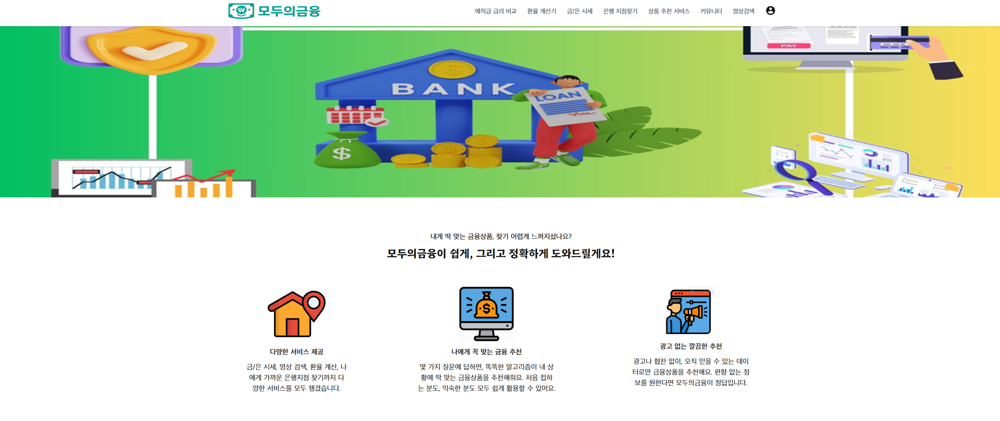
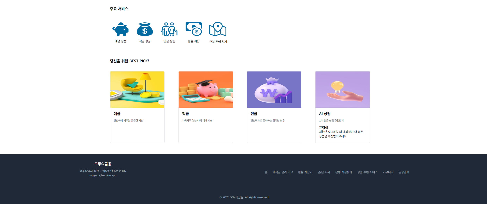

### 금/은 시세 페이지
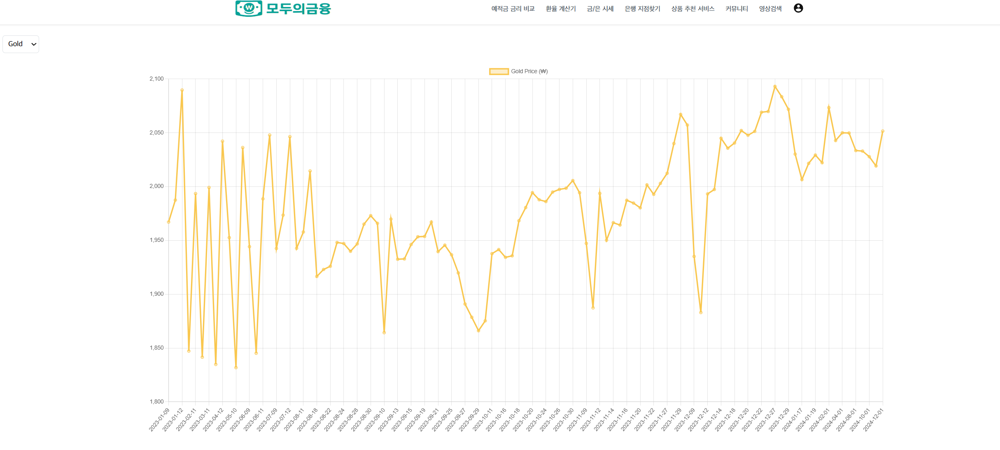  
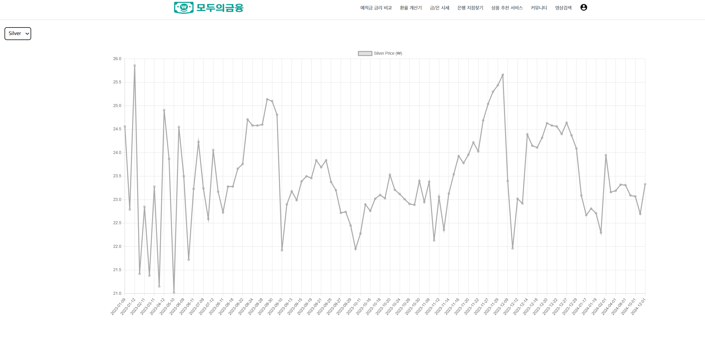  
✔️ 일자별 금/은 시세 확인 가능

### 예적금 금리 비교
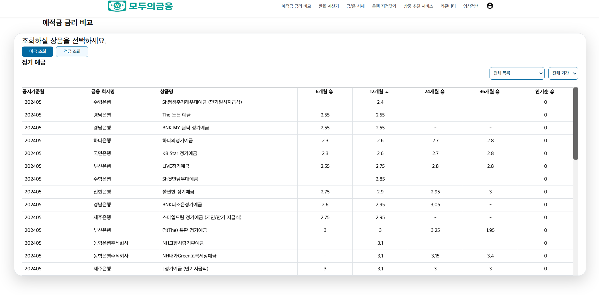

### 원하는 은행 찾기
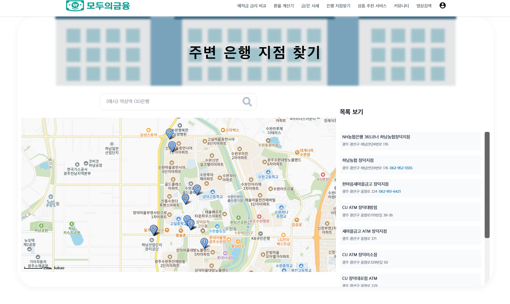  
✔️ 도시/은행명 검색 가능

### 금융 영상 검색
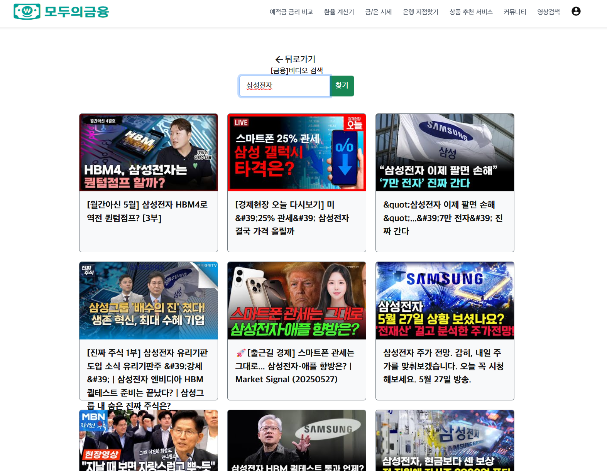  
✔️ 키워드 기반 영상 검색 기능 제공

### 환율 계산기
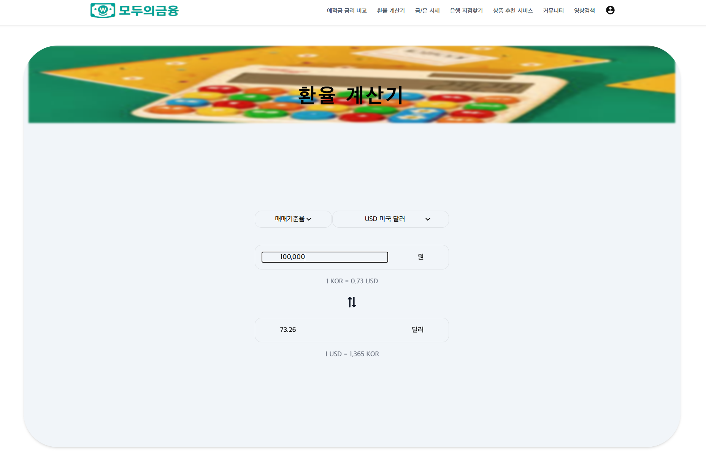

### 커뮤니티 게시판
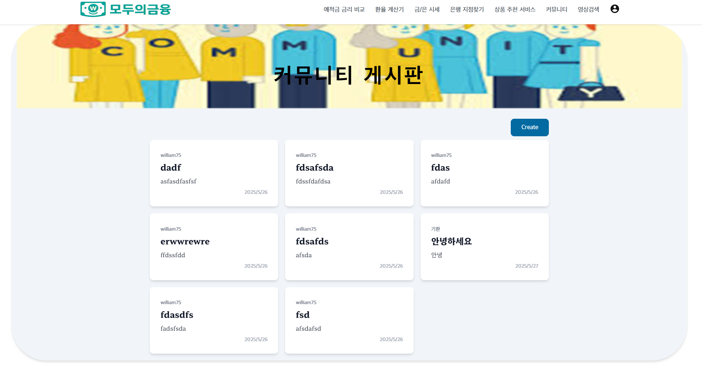

### 금융 상품 추천
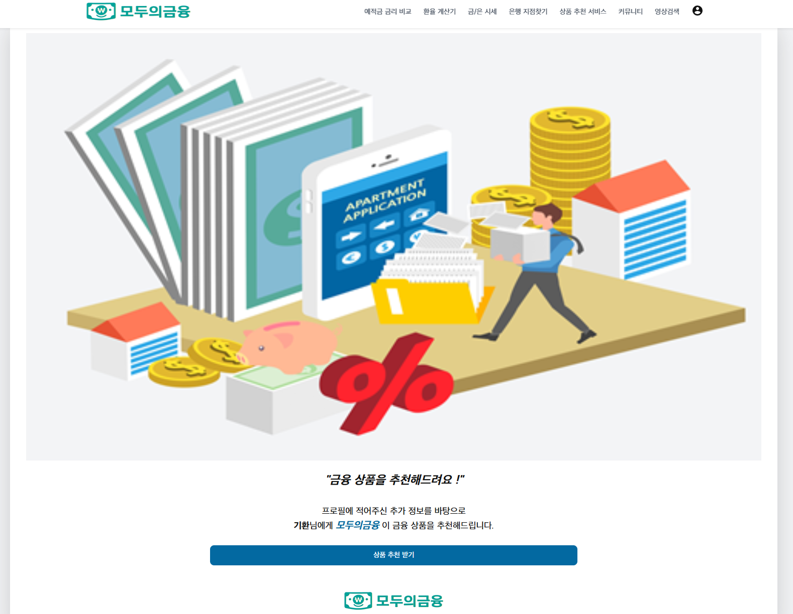
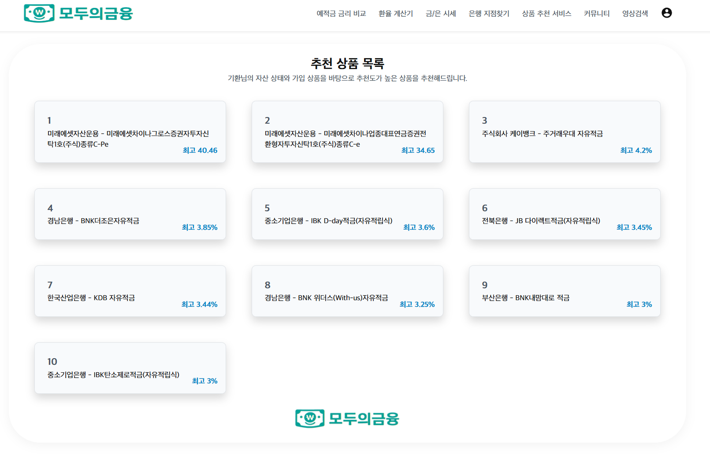

---

## 🛠️ 개발 과정

### 🗓️ 5월 22일
 1. 프로젝트 방향성 잡기 위한 회의
    ✨처음부터 끝까지 다 우리 힘으로 구현하자
    => 재테크가 필요하다는 것은 모두가 알고 있지만 어렵고 복잡하다는 인식 때문에 시작하기 어려운 사람이 많음.
    모든 사람이 금융을 쉽다고 생각할 수 있도록 허들을 낮춘 금융 사이트를 만들자.
    금융을 하나도 모르는 사람도 어렵다고 느끼지 않고, 배우고, 이용할 수 있도록.
    How?
    - 큰 배너와 아이콘
    - 불필요한 걸 빼고 간결하게 필요한 것들만 담자
    - 금융용어집을 만들어서 기초 금융지식도 쉽게 알 수 있도록 하자.
    - front는 vue.js로, back은 django로 구현하자.

    2. 기본 skeleton 코드 직접 작성해서 각각의 url 연결하고, 기본 Home 화면 구현
    - 초보자도 쉽게 접할 수 있도록 CSS 어떻게 구성하면 좋을지(모두가 쉽게 접할 수 있도록 친숙한 색깔 등등) gpt 도움 받음.
    - 각각의 경우 의문점 직접 부딪히면서 해결
        1) Home 메뉴 div 태그로 감싸기 (어디서부터 어디까지 감싸야 하는지)
        2) <Routerview/> 써주지 않아서 화면이 뜨지 않음.
            -> Vue Router는 "어떤 페이지를 보여줘야 할지" 알고는 있지만 그 컴포넌트를 화면에 실제로 "그릴 위치"가 없기 때문에 아무것도 렌더링되지 않고 빈 화면처럼 보인 것! 띄울 위치 지정을 <Routerview/>로 해줌.
        3) CSS 적용 안됨.(박스 너비, 여백 등)
            -> Routerlink는 내부적으로 a태그(inline)로 렌더링 된다. 따라서 display block 처리 해줘야 한다.
        4) Routerlink와 a태그 차이
            -> Routerlink는 뷰만 바꿔서 새로고침 없이 페이지 전환한다. (로그인 상태 유지)
            -> a 태그는 전체 페이지 새로 고침. (로그인 여부, vuex 상태, 로컬 캐시 등이 사라질 수 있다)    
            -> 네이버는 a 태그이던데, 새로고침 해도 로그인 여부 안 사라지던데?
            -> 쿠키, 세션, 로컬 스토리지 등에 인증 정보를 저장해둬서 그렇다.

### 🗓️ 5월 23일
    1. 백 구현 다 하고 프론트 해야 함. (API에 의존하는 부분에서 에러 발생 함...)
    2. 로그인 / 회원가입 기능 구현
    3. 로그인 기능 구현 하는데 자꾸만 404 error 남.
        -> kebab-case로 작성 안해서 생긴 문제

### 🗓️ 5월 24~25일
- 각자 맡은 기능 개발

### 🗓️ 5월 26일
     1. 로그인/ 로그아웃 백엔드 오류
    -> cookie로 접근 하도록 수정
    2. 예적금 금리 비교 페이지, 상품 추천 페이지 오류.
    -> views.py랑 관련 vue 파일 다 수정해줘도 안됐는데, 결과적으로
        1) 로그인 세션 먼저 처리해줘야 뜨도록 설정해놓음.
        2) 데이터를 로드하지 않아서 생긴 실수. python manage.py loaddata....
    3. 커뮤니티 구현 완료
    4. 크롤링에 어려움 겪음.
    -> ssafy 측에서 제공해준 데이터 사용
    5. 영상 검색 시 Youtube API_key가 자음, 모음 칠 때마다 각각 요청됨.
        -> 코드 수정을 통해 검색 버튼을 클릭해야만 요청되도록 수정.

### 🗓️ 5월 27일
    1. 환율 계산기 API 키 전달에 문제 발생.
    -> SSL 인증서 검증 오류라 certifi 패키지 업데이트 해줌.
    2. 금, 은 시세 chart.js 통해 구현
    3. 로그인 부분 페이지 안 뜸.
    userstore를 불러온다고 써놓고, 정작 store 사용. 수정해줌.
    4. CSS 최종 수정
    5. 리드미 작성
    6. PPT 제작 및 발표 준비

---

## 🗃️ 프로젝트 후기

### 🔧 트러블슈팅

- `<RouterView/>`, `loaddata`, `kebab-case` 등 기초 실수에서 많은 문제가 발생
- 로그인 세션 관리 및 외부 API 타이밍 이슈
- 데이터베이스 초기화 누락 빈번

---

## 🎯 느낀 점 & 깨달은 점

### 하기환

**느낀 점**  
기본 구현을 지나 메인 구현에 들어갈 때에 큰 막막함을 느끼고 "이런 방향으로 가야겠다"라고 계획한 것들이 얼마 지나지 않아 방향을 틀게 되고 또다시 돌아오게 되는 것을 반복하며 많은 좌절감을 맛본 것 같다. 기준을 세우고 정확히 잡으며 가는 길의 방법이 확정됐고 다행히 결국 프로젝트는 끝나게 됐다. 며칠 동안 컴퓨터 앞에서 무언가를 만들기 위해 몰두한 경험은 전무했는데 끝나고 나서 다시 그 시간들을 돌아보니 자랑스러웠고 결과물을 떠나 값진 시간이었다고 생각한다. 또 혼자 무언가를 이뤄나가는 것이 편하다고 생각을 해왔지만 꼭 그런 것은 아니었고 협력의 힘이 얼마나 큰지도 깨달았다. 개발은 혼자 해도 되지만 혼자가 아닐 때 빛을 발한다는 것을 느꼈다.

**깨달은 점**  
생성형 ai를 통해 우리는 전보다는 쉽게 코드 작성이 가능해졌지만 절대적으로 전체 흐름과 코드의 디테일들을 알지 못한다면 결국 그 코드는 내가 구현하고 만들었더라도 내가 만든 것이 아니라는 것을 깨달았다. 어떤 분야보다 디테일과 세밀함이 중요하다고 생각했으며 '대충'이라는 단어가 어울리지 않는 직군이라는 것을 크게 느꼈다. 앞으로의 개발 방향은 이러한 관점에 초점을 맞추고 나아갈 것이며 컴퓨터가 정직한 만큼 나도 지름길을 찾지 않고 정직하게 개발의 길을 나아가야겠다.

---

### 이채은

**느낀 점**  
매번 있었던 관통 프로젝트 때는 하나의 페이지에 하나의 기능만을 구현했었는데, 이번에 하나의 페이지에 여러 개의 기능을 구현해 보니 훨씬 어려웠다. 이미 해본 것도 있었고, 처음 해보는 것도 있었는데 하나가 뜨면 하나가 오류 나고 완전 혼란 그 자체였다. 멀쩡히 기능하던 것들이 왜 갑자기 안되는지, 같은 코드를 몇 번이나 보고 수정 또 수정했는지 모른다. skeleton 코드 없이 기본 구조를 짜다 보니 느낀 것은 기본이 가장 중요하다는 것이었다. 왜 안되지 하고 애먼 곳을 몇 번이고 고쳤는데 결국 해답은 <Routerview/>, loaddata와 같이 기본적인 아주 간단한 것들이었던 경우가 많았다. 기본이 얼마나 중요한지 새삼 깨달았다. 열심히 한다고 했는데, 시간이 너무 부족해서 아쉬움이 많이 남는다. 기능 구현에서도 아쉬움이 남지만 CSS에 특히 아쉬움이 크게 남는다. 다음에 기회가 된다면 좀 더 사용자가 쉽다고 느낄 수 있도록 CSS도 수정하고, 이 페이지에서 모든 금융 관련 일들을 할 수 있도록 주식, 코인 창을 추가한다든지, 금융 사전을 추가한다든지 기능적으로도 좀 더 발전시키고 싶다. 내 부족함을 너무 많이, 속속들이 알게 된 계기였지만 또 그만큼 많이 배웠다. 2학기 프로젝트는 시간 분배를 더 잘하고, 계획을 좀 더 세세하게 짜서 이번 프로젝트보다는 훨씬 발전된 결과물을 만들어 내겠다.

**깨달은 점**  
생성형 AI로 여태 코드 도움을 많이 받아서, chat GPT 무적이라고 생각했는데 전체적인 흐름이나 기본 구조에 대한 지식은 결국 내 몫이라는 것을 깨달았다. chat GPT를 잘 쓰려면 어쨌든 내가 잘 알아야 한다고, 모르면 못 쓴다고 강사님께서 말씀하셨던 게 생각이 났다. 방학동안은 더 열심히 공부해서 gpt 도움을 최대한 덜 받고도 프로젝트 만들 수 있도록 해야겠다.

---

